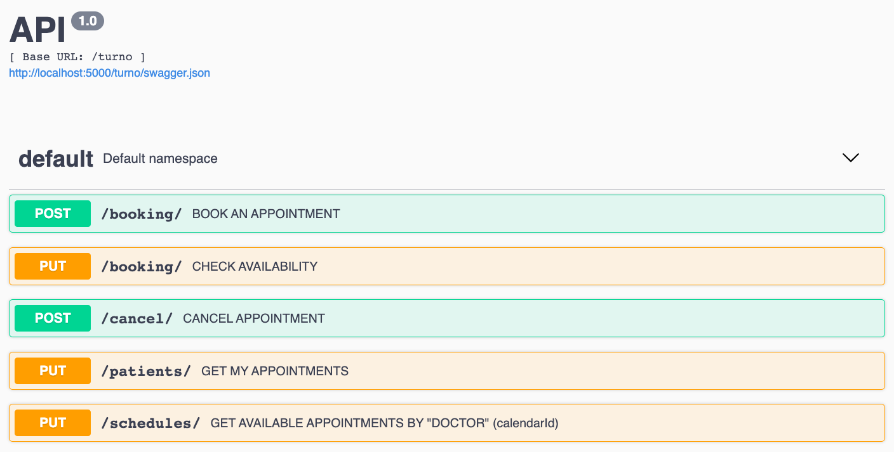

# Flask RestX Google Calendar API
Documentation at http://localhost:5000



## installation of dependencies

Create environment:

```python3 -m venv ./venv```

Activate environment:

```source ./venv/bin/activate```

Install dependencies:

```pip install -r requirements.txt```

## Run the API:

```python3 run.py```

## Initial setup

### Step 1
Following instructions in **calendar_setup.md** to generate a token.pkl file. Place thsi pickle file in the directory **turnero/turno/tokens** .
### Step 2
Run the api. 

```python3 run.py```

### Step 3
Using the Swagger UI at **http://localhost:5000/auth/doc** choose the PUT "Register a new password and return a hash for storage" option. The API will return your new hashed password. Paste that hashed password in the file **turnero/auth/views.py** at:
```
users = {
    "my_new_username": "my_new_hashed_password...dfanofapondpafasn",
}
```
### Step 4
restart the server

```python3 run.py```

Have fun!🔥
