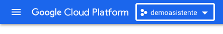
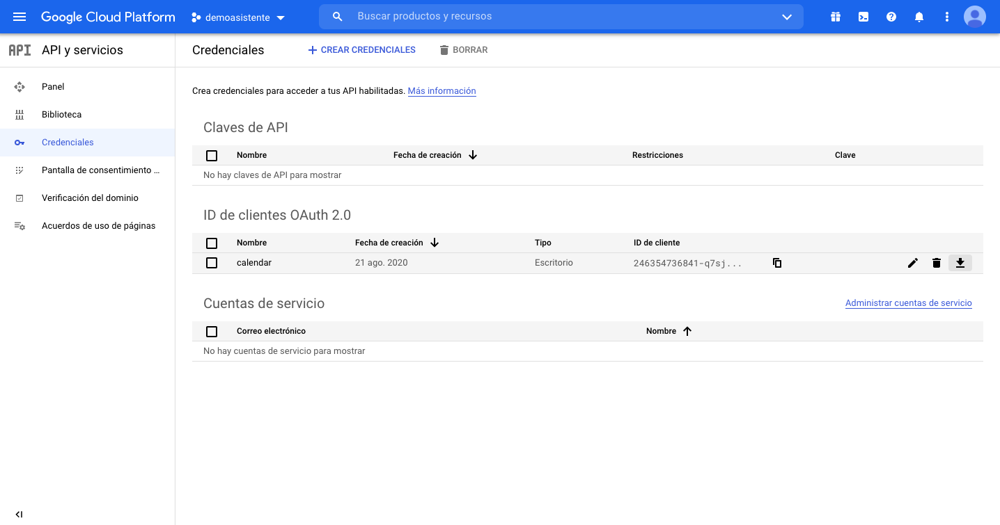

# Instructions for setting up Turnero integration with Oauth2

Open Google Console and select the project linked to the Oauth2 account.



On the GC Dashboard in the section APIs, click "Go to APIs Overview".

The APIs and Services menu should look like this:



Under the heading, "ID de clientes OAuth 2.0", click the download button.


This JSON file is what we need to authorize access to the Oauth2 protected application. Name te file: **client_secret.json**. 

Run the following lines of code:
```
from apiclient.discovery import build
from google_auth_oauthlib.flow import InstalledAppFlow
import pickle
scopes = ['https://www.googleapis.com/auth/calendar']
flow = InstalledAppFlow.from_client_secrets_file("client_secret.json", scopes=scopes)
credentials = flow.run_console()
pickle.dump(credentials, open("token.pkl", "wb"))
```

Place token.pkl in the directory **turnero/turno/tokens**. 

Done.

